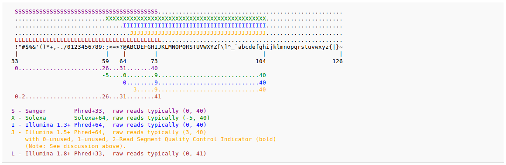

> ## Learning Objectives {.objectives}
>
> * Understanding a FASTQ file structure
> * Controlling the Quality and encoding of a FASTQ file
> * Removing adapters and low-quality reads and bases

#Picking up Data

Download the [dataset][dataLink] and uncompress it using
~~~{.bash}
~$ unzip data.zip
~~~
The original FASTQ data are in the *Data* folder (*all_seq_1.fastq *and *all_seq_2.fastq*).

#Understanding FASTQ Format

Take a look to the FASTQ files content using the *head* or *tail* command utilities

~~~{.bash}
~$ head data/all_seq_1.fastq
@RC10_HWUSI-EAS454_0006:1:99:16639:1487#TAGCTT/1
TTCTTGTGTAGATTGGGAAATTTCAGTTGGACTGCATCAATGGGGATCCCCTAGTTGGCCTCAGCAAGTGTGGAAG
+
fffdfefffafefffffffcfeffdfffffefefffefeefbefef`effeeefeff`fc^eeeea`d`dadbbad
@RC10_HWUSI-EAS454_0006:1:110:8483:17695#TAGCTT/1
GAAAAGTGCATCCACACTTGCTGAGGCCAACTAGGGGATCCCCATTGATGCAGTCCAACTGAAATTTCCCAATCTA
+
fffffefcffffffffffffffffffffffedeedfeefeffff^feefffdffcedfddfdfdeddcfea\dade
@RC10_HWUSI-EAS454_0006:1:25:5030:7161#TAGCTT/1
NTCAATTCTTGTGTAGATTGGGAAATTTCAGTTGGACTGCATCAATGGGGATCCCCTAGTTGGCCTCAGCAAGTGA
~~~

It will automatically display in the terminal the 10 first lines of the *all_seq_1.fastq* file. Using *tail* will display the last 10 lines instead.

Individual reads are represented on four lines:
> 1- Name of the read preceeded by a "@"
> 2- Sequence of the read
> 3- A line with '+', that can be followed by the name of the read again
> 4- The Quality score of each base encoded in ASCII format

The Quality is encoded in ASCII format, as followed (from https://en.wikipedia.org/wiki/FASTQ_format#Encoding)

The Quality value (from 0 to 40 generally) represents the probability that the given base is not an erroneous one. The exact formula is Q~sanger~ = -10 log~10~ *p*

#Quality control using FASTQC

FASTQC can be used to obtain different informations on the Fastq files: read number, size, quality per base and per sequence, GC content per base and per sequence, N content, overrepresented sequences and k-mer content. It can be used either through grapical way or in command line. We will use here the command line to obtain those informations.

~~~{.bash}
~$ fastqc -o 1_fastqc/ all_seq_1.fastq
~~~

Here the software will provide the different informations on the *all_seq_1.fastq* file and will report those informations in the *1_fastqc* folder (that will be created) in an HTML file.

~~~ {.python}
some code:
    to be displayed
~~~
~~~ {.output}
output
from
program
~~~
~~~ {.error}
error reports from program (if any)
~~~

and possibly including:

> ## Callout Box {.callout}
>
> An aside of some kind.

> ## Challenge Title {.challenge}
>
> Description of a single challenge.
> There may be several challenges
> that make reference to [Challenge Title](01-one.html#challenge-title).

[dataLink]:http://***/data.zip
